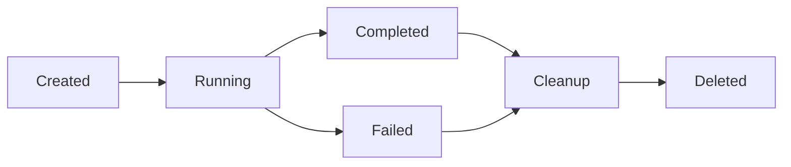

# 🏗️ System Architecture

This document provides a detailed overview of Wegent's system architecture, component design, and technology stack.

---

## 📋 Table of Contents

- [Architecture Overview](#architecture-overview)
- [Core Components](#core-components)
- [Data Flow and Communication Patterns](#data-flow-and-communication-patterns)
- [Technology Stack](#technology-stack)
- [Design Principles](#design-principles)
- [Scalability and Deployment](#scalability-and-deployment)

---

## 🌐 Architecture Overview

Wegent adopts a modern layered architecture design based on Kubernetes-style declarative API and CRD (Custom Resource Definition) design patterns, providing a standardized framework for creating and managing AI agent ecosystems.

### System Architecture Diagram

```mermaid
graph TB
    subgraph "🖥️ Management Platform Layer"
        Frontend["🌐 Next.js Frontend<br/>React 19 + TypeScript"]
        Backend["⚙️ FastAPI Backend<br/>Python + SQLAlchemy"]
        API["🚀 Declarative API<br/>Kubernetes-style"]
    end

    subgraph "📊 Data Layer"
        MySQL[("💾 MySQL Database<br/>v9.4")]
        Redis[("🔴 Redis Cache<br/>v7")]
    end

    subgraph "🔍 Execution Layer"
        ExecutorManager["💯 Executor Manager<br/>Task Scheduling & Orchestration"]
        Executor1["🚀 Executor 1<br/>Isolated Sandbox"]
        Executor2["🚀 Executor 2<br/>Isolated Sandbox"]
        ExecutorN["🚀 Executor N<br/>Isolated Sandbox"]
    end

    subgraph "🤖 Agent Layer"
        Claude["🧠 Claude Code<br/>Coding Agent"]
        Agno["💻 Agno<br/>Chat Agent"]
        Dify["✨ Dify<br/>External API Agent"]
    end


    %% System Interactions
    Frontend --> API
    API --> Backend
    Backend --> MySQL
    Backend --> Redis
    Backend --> ExecutorManager
    ExecutorManager --> Executor1
    ExecutorManager --> Executor2
    ExecutorManager --> ExecutorN

    %% AI Program Integration
    Executor1 --> Claude
    Executor2 --> Agno
    ExecutorN --> Dify

    %% Styling
    classDef platform fill:#e3f2fd,stroke:#1976d2,stroke-width:2px
    classDef data fill:#fff3e0,stroke:#f57c00,stroke-width:2px
    classDef execution fill:#f3e5f5,stroke:#7b1fa2,stroke-width:2px
    classDef agent fill:#e8f5e9,stroke:#388e3c,stroke-width:2px

    class Frontend,Backend,API platform
    class MySQL,Redis data
    class ExecutorManager,Executor1,Executor2,ExecutorN execution
    class Claude,Agno,Dify agent
```



### Architecture Layers

| Layer | Responsibilities | Core Technologies |
|-------|-----------------|-------------------|
| **Management Platform Layer** | User interaction, resource management, API services | Next.js 15, FastAPI, React 19 |
| **Data Layer** | Data persistence, cache management | MySQL 9.4, Redis 7 |
| **Execution Layer** | Task scheduling, container orchestration, resource isolation | Docker, Python |
| **Agent Layer** | AI capabilities, code execution, chat processing, external API integration | Claude Code, Agno, Dify |

---

## 🔧 Core Components

### 1. 🌐 Frontend

**Responsibilities**:
- Provide user interface for resource definition and management
- Implement task creation, monitoring, and result display
- Provide real-time interaction and status updates

**Technology Stack**:
- **Framework**: Next.js 15 (App Router)
- **UI Library**: React 19, Ant Design 5
- **Styling**: Tailwind CSS 3
- **State Management**: React Hooks
- **Internationalization**: i18next
- **Icons**: Heroicons, Tabler Icons

**Core Features**:
- 🎨 Configuration-driven UI with YAML visualization
- 🔄 Real-time task status updates
- 🌍 Multi-language support (Chinese/English)
- 📱 Responsive design

**Key File Structure**:
```
frontend/
├── app/              # Next.js App Router
├── components/       # React components
├── public/          # Static assets
└── package.json     # Dependencies
```

---

### 2. ⚙️ Backend

**Responsibilities**:
- Implement declarative API for resource CRUD operations
- Manage user authentication and authorization
- Coordinate execution layer for task scheduling
- Provide WebSocket support for real-time chat communication (Socket.IO)

**Technology Stack**:
- **Framework**: FastAPI 0.68+
- **ORM**: SQLAlchemy 2.0
- **Database Driver**: PyMySQL
- **Authentication**: JWT (PyJWT), OAuth (Authlib)
- **Async Support**: asyncio, aiohttp
- **Cache**: Redis client
- **Real-time Communication**: Socket.IO (python-socketio) with Redis adapter

**Core Features**:
- 🚀 High-performance async API
- 🔒 JWT-based authentication
- 📝 Complete CRUD operation support
- 🔄 Real-time status synchronization
- 🛡️ Data encryption (AES)
- 👥 Role-based access control (admin/user)

**API Design**:
```
/api/v1/
├── /ghosts          # Ghost resource management
├── /models          # Model resource management
├── /shells          # Shell resource management
├── /bots            # Bot resource management
├── /teams           # Team resource management
├── /workspaces      # Workspace resource management
├── /tasks           # Task resource management
└── /admin           # Admin operations (user management, public models)
```

**Key Dependencies**:
```python
FastAPI >= 0.68.0      # Web framework
SQLAlchemy >= 2.0.28   # ORM
PyJWT >= 2.8.0         # JWT authentication
Redis >= 4.5.0         # Cache
httpx >= 0.19.0        # HTTP client
```

---

### 3. 💯 Executor Manager

**Responsibilities**:
- Manage Executor lifecycle
- Task queue and scheduling
- Resource allocation and rate limiting
- Callback handling

**Technology Stack**:
- **Language**: Python
- **Container Management**: Docker SDK
- **Networking**: Docker bridge network

**Core Features**:
- 🎯 Maximum concurrent task control (default: 5)
- 🔧 Dynamic port allocation (10001-10100)
- 🐳 Docker container orchestration
- 📊 Task status tracking

**Configuration Parameters**:
```yaml
MAX_CONCURRENT_TASKS: 5              # Maximum concurrent tasks
EXECUTOR_PORT_RANGE_MIN: 10001      # Port range start
EXECUTOR_PORT_RANGE_MAX: 10100      # Port range end
NETWORK: wegent-network              # Docker network
EXECUTOR_IMAGE: wegent-executor:latest # Executor image
```

---

### 4. 🚀 Executor

**Responsibilities**:
- Provide isolated sandbox environment
- Execute agent tasks
- Manage workspace and code repositories
- Report execution results

**Technology Stack**:
- **Container**: Docker
- **Runtime**: Claude Code, Agno, Dify
- **Version Control**: Git

**Core Features**:
- 🔒 Fully isolated execution environment
- 💼 Independent workspace
- 🔄 Automatic cleanup mechanism
- 📝 Real-time log output

**Lifecycle**:


---

### 5. 💾 Database (MySQL)

**Responsibilities**:
- Persistent storage of all resource definitions
- Manage user data and authentication information
- Record task execution history

**Version**: MySQL 9.4

**Core Table Structure**:
```
wegent_db/
├── ghosts           # Ghost definitions
├── models           # Model configurations
├── shells           # Shell configurations
├── bots             # Bot instances
├── teams            # Team definitions
├── workspaces       # Workspace configurations
├── tasks            # Task records
├── users            # User information (with role field)
└── public_models    # System-wide public models
```

**Data Model Features**:
- Uses SQLAlchemy ORM
- Supports transactions and relational queries
- Automatic timestamp management
- Soft delete support

---

### 6. 🔴 Cache (Redis)

**Responsibilities**:
- Task status caching
- Session management
- Temporary real-time data storage
- Task expiration management

**Version**: Redis 7

**Use Cases**:
- 🔄 Chat task context caching (2-hour expiration)
- 💻 Code task status caching (2-hour expiration)
- 🎯 Executor deletion delay control
- 📊 Real-time status updates

---

## 🔄 Data Flow and Communication Patterns

### Task Execution Flow

```mermaid
sequenceDiagram
    participant User as 👤 User
    participant Frontend as 🌐 Frontend
    participant Backend as ⚙️ Backend
    participant MySQL as 💾 MySQL
    participant Redis as 🔴 Redis
    participant EM as 💯 Executor Manager
    participant Executor as 🚀 Executor
    participant Agent as 🤖 Agent

    User->>Frontend: 1. Create Task
    Frontend->>Backend: 2. POST /api/v1/tasks
    Backend->>MySQL: 3. Save task definition
    Backend->>Redis: 4. Cache task status
    Backend->>EM: 5. Schedule task execution
    EM->>Executor: 6. Create Executor container
    Executor->>Agent: 7. Start agent
    Agent->>Executor: 8. Execute task
    Executor->>EM: 9. Report execution result
    EM->>Backend: 10. Callback to update status
    Backend->>MySQL: 11. Update task record
    Backend->>Redis: 12. Update cache status
    Backend->>Frontend: 13. WebSocket push
    Frontend->>User: 14. Display result
```



### Communication Protocols

| Communication Type | Protocol | Purpose |
|-------------------|----------|---------|
| **Frontend ↔ Backend** | HTTP/HTTPS, WebSocket (Socket.IO) | API calls, real-time chat streaming |
| **Backend ↔ Database** | MySQL Protocol | Data persistence |
| **Backend ↔ Redis** | Redis Protocol | Cache operations, Socket.IO adapter |
| **Backend ↔ Executor Manager** | HTTP | Task scheduling |
| **Executor Manager ↔ Executor** | Docker API | Container management |
| **Executor ↔ Agent** | Process invocation | Task execution |

### WebSocket Architecture (Socket.IO)

The chat system uses Socket.IO for bidirectional real-time communication:

**Namespace**: `/chat`
**Path**: `/socket.io`

**Client → Server Events**:
| Event | Purpose |
|-------|---------|
| `chat:send` | Send a chat message |
| `chat:cancel` | Cancel ongoing stream |
| `chat:resume` | Resume stream after reconnect |
| `task:join` | Join a task room |
| `task:leave` | Leave a task room |
| `history:sync` | Sync message history |

**Server → Client Events**:
| Event | Purpose |
|-------|---------|
| `chat:start` | AI started generating response |
| `chat:chunk` | Streaming content chunk |
| `chat:done` | AI response completed |
| `chat:error` | Error occurred |
| `chat:cancelled` | Stream was cancelled |
| `chat:message` | Non-streaming message (group chat) |
| `task:created` | New task created |
| `task:status` | Task status update |

**Room-based Message Routing**:
- User Room: `user:{user_id}` - For personal notifications
- Task Room: `task:{task_id}` - For chat streaming and group chat

**Redis Adapter**: Enables multi-worker support for horizontal scaling

---

## 🛠️ Technology Stack

### Frontend Stack

```typescript
{
  "framework": "Next.js 15",
  "runtime": "React 19",
  "language": "TypeScript 5.7",
  "ui": [
    "Ant Design 5.27",
    "Tailwind CSS 3.4",
    "Heroicons 2.2"
  ],
  "i18n": "i18next 25.5",
  "markdown": "react-markdown",
  "devTools": [
    "ESLint 9.17",
    "Prettier 3.4",
    "Husky 9.1"
  ]
}
```

### Backend Stack

```python
{
    "framework": "FastAPI >= 0.68.0",
    "language": "Python 3.10+",
    "orm": "SQLAlchemy >= 2.0.28",
    "database": "PyMySQL 1.1.0",
    "auth": [
        "PyJWT >= 2.8.0",
        "python-jose 3.3.0",
        "passlib 1.7.4"
    ],
    "async": [
        "asyncio >= 3.4.3",
        "aiohttp >= 3.8.0",
        "httpx >= 0.19.0"
    ],
    "cache": "redis >= 4.5.0",
    "security": [
        "cryptography >= 41.0.5",
        "pycryptodome >= 3.20.0"
    ],
    "testing": [
        "pytest >= 7.4.0",
        "pytest-asyncio >= 0.21.0"
    ]
}
```

### Infrastructure

```yaml
database:
  mysql: "9.4"

cache:
  redis: "7"

container:
  docker: "latest"
  docker-compose: "latest"

executor_engines:
  - "Claude Code (Anthropic)"
  - "Agno"
  - "Dify"
```

---

## 🎯 Design Principles

### 1. Declarative API Design

Following Kubernetes CRD design patterns:
- ✅ Resources defined declaratively in YAML
- ✅ Clear resource hierarchy
- ✅ Unified API version management
- ✅ Separation of status and desired state

**Example**:
```yaml
apiVersion: agent.wecode.io/v1
kind: Bot
metadata:
  name: developer-bot
  namespace: default
spec:
  # Desired state
  ghostRef:
    name: developer-ghost
status:
  # Actual state
  state: "Available"
```

### 2. Separation of Concerns

- 🎨 **Frontend**: Focused on user interaction and presentation
- ⚙️ **Backend**: Focused on business logic and data management
- 🚀 **Execution Layer**: Focused on task scheduling and resource isolation
- 🤖 **Agent Layer**: Focused on AI capability provision

### 3. Microservices Architecture

- 🔧 Each component deployed independently
- 📦 Containerized packaging
- 🔄 Loose coupling between services
- 📊 Independent scaling capability

### 4. Security First

- 🔒 JWT authentication mechanism
- 🛡️ AES encryption for sensitive data
- 🔐 Sandbox environment isolation
- 🚫 Principle of least privilege
- 👥 Role-based access control (admin/user roles)

### 5. Observability

- 📝 Structured logging (structlog)
- 📊 Status tracking and monitoring
- 🔍 Detailed error information
- 📈 Performance metrics collection

---

## 📈 Scalability and Deployment

### Horizontal Scaling

#### Frontend Scaling
```yaml
# Multi-instance deployment
frontend:
  replicas: 3
  load_balancer: nginx
```

#### Backend Scaling
```yaml
# Stateless design, supports multiple instances
backend:
  replicas: 5
  session: redis
```

#### Executor Scaling
```yaml
# Dynamic creation and destruction
executor_manager:
  max_concurrent_tasks: 20
  auto_scaling: true
```

### Vertical Scaling

#### Database Optimization
- Read-write separation
- Index optimization
- Query caching

#### Redis Optimization
- Memory optimization
- Persistence strategy
- Cluster mode

### Deployment Modes

#### 1. Single-Machine Deployment (Development/Testing)
```bash
docker-compose up -d
```

**Use Cases**:
- Local development
- Feature testing
- Small-scale usage

#### 2. Distributed Deployment (Production)
```yaml
architecture:
  frontend: "Multi-instance + Nginx load balancing"
  backend: "Multi-instance + API gateway"
  mysql: "Master-slave replication + read-write separation"
  redis: "Redis Cluster"
  executor: "Dynamic scaling"
```

**Use Cases**:
- Production environment
- High concurrency requirements
- Large-scale teams

#### 3. Cloud-Native Deployment (Kubernetes)
```yaml
apiVersion: apps/v1
kind: Deployment
metadata:
  name: wegent-backend
spec:
  replicas: 3
  template:
    spec:
      containers:
      - name: backend
        image: wegent-backend:latest
```

**Use Cases**:
- Cloud environments
- Auto-scaling
- High availability requirements

### Performance Metrics

| Metric | Target Value | Description |
|--------|--------------|-------------|
| **API Response Time** | < 200ms | P95 latency |
| **Task Startup Time** | < 5s | From creation to execution |
| **Concurrent Tasks** | 5-100 | Configurable |
| **Database Connection Pool** | 20 | Default configuration |
| **WebSocket Connections** | 1000+ | Concurrent online |

### Monitoring and Alerting

#### Key Metrics
- 📊 Task success rate
- ⏱️ Task execution time
- 💾 Database performance
- 🔴 Redis cache hit rate
- 🐳 Container resource usage

#### Log Collection
```python
import structlog

logger = structlog.get_logger()
logger.info("task.created",
    task_id=task.id,
    team=task.team_ref.name)
```

---

## 🔗 Related Resources

- [Core Concepts](./core-concepts.md) - Understand Wegent's core concepts
- [Collaboration Models](./collaboration-models.md) - Deep dive into collaboration patterns
- [YAML Specification](../reference/yaml-specification.md) - Complete configuration guide
- [Developer Guide](../guides/developer/setup.md) - Start developing with Wegent

---

<p align="center">Understanding the architecture is key to mastering Wegent! 🚀</p>
